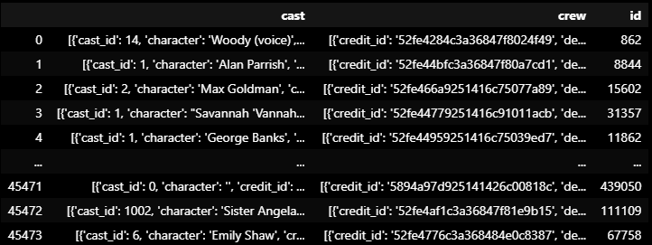

# Proyecto Individual 1: Machine Learning Operations.
## Introducción:
Este proyecto tenía como objetivo personal poner en práctica el amplio abanico de conocimientos adquiridos durante el curso de Data Science Full Time en SoyHenry.
Como objetivo profesional, el 'Cliente' nos pidió tener desarrollado un MVP de un Modelo de Recomendación de Películas para plataformas de Streaming en una semana.
Los desafíos que se pueden identificar a simple vista son dos:
1. La baja calidad y madurez de la base de datos.
2. La velocidad con la que se tiene que llevar a cabo el proyecto.

Dada las circunstancias, ¡mejor será que nos pongamos manos a la obra!

## Índice
1. [Introducción](#introducción)
2. [Consideraciones Iniciales](#'Consideraciones-iniciales')
3. [Extracción, Carga y Transformación de los Datos (ETL)](#Extracción,-Carga-y-Transformación-de-los-Datos-(ETL))
4. [Creación de funciones](#Creación-de-funciones)

## Consideraciones iniciales
Contamos con una base de datos compuesta por dos archivos CSV (**movies_dataset.csv y credits.csv**) de alrededor de 45.000 filas de datos brutos que deben ser procesados para su uso en 6 funciones mínimas (detalladas más adelante) pedidas explícitamente por el cliente.
Dichas funciones deben ser posteriormente implementadas mediante una API y presentadas haciendo uso de [Render](https://dashboard.render.com/) para su accesibilidad.
Es necesario también un Análisis Exploratorio de los Datos (EDA) que será usado por el departamento de Analytics del cliente para mejorar la implementación del modelo.

A continuación, se hace un resumen del proceso completo.

## Extracción, Carga y Transformación de los Datos (ETL)
Dentro de los Notebooks se encuentra el archivo ETL que contiene el proceso detallado mediante el cual se dio forma a los datos.
La información se encontraba separada en dos archivos: **movies_dataset.csv** contiene información general de las películas, mientras que **credits.csv** está orientado a las personas que participaron de la filmación de los metrajes.
Los datos dentro de los archivos no estaban normalizados, por lo que no estaban listos para ser trabajados. Se tuvo que hacer un proceso de desanidado de columnas y extracción de la información, así como también la eliminación de columnas que no aportaban valor y traían complejidad al proyecto.
Además, se crearon nuevas columnas que iban a ser necesarias para el correcto funcionamiento de las funciones y se hizo un manejo preliminar de valores nulos y/o duplicados.
Todo esto fue almacenado en un archivo tipo **.parquet**, que sera la nueva fuente de los datos solicitados por las funciones.

## Creación de funciones
En el archivo **main.py** se pueden ver las funciones creadas en detalle.
Se utiliza la librería FastAPI para crear la API que permitirá acceder a ellas. Cada una hace una consulta a la base de datos procesada en el paso anterior que le permite extraer información relevante.
Los 6 endpoints dan acceso a las funciones detalladas a continuación:
- Películas por mes: Se selecciona un mes del año y se hace un conteo del número de filmaciones estrenadas en él.
- Películas por día: Se selecciona un día de la semana y se hace un conteo del número de filmaciones estrenadas en él.
- Score de película: Se escribe el título de una filmación y retorna su año de estreno y un valor numérico en representación de su popularidad.
- Votación de película: Se escribe el título de una filmación y retorna su año de estreno y, si cumple con un mínimo de valoraciones, el promedio de las mismas.
- Información de actor: Se escribe el nombre de un actor y retorna el número de filmaciones en las que ha participado, el porcentaje de retorno de sus películas total y promedio a lo largo de su carrera.
- Información de director: Se escribe el nombre de un director y retorna el número y lista de filmaciones en las que ha participado solo como director, junto con su porcentaje de retorno.

Terminadas las funciones se hizo un deploy en Render.
[Aquí](https://proyecto-individual-1-henry-k9qg.onrender.com/docs) puedes acceder a ella.

## Analisis Exploratorio de los Datos (EDA)
Dentro de los Notebooks se encuentra el archivo EDA que contiene el proceso detallado mediante el cual se analizo la relevancia de los datos y se hicieron los ajustes necesarios para su funcionamiento.
Una parte de la preparacion de datos habia sido ejecutada durante el proceso de [ETL](#Extracción,-Carga-y-Transformación-de-los-Datos-(ETL)), el proceso de limpieza y normalizacion continuo para asegurarse que los datos del archivo *.parquet* solicitados por las funciones sean correctos. Tambien se hizo un analisis un poco mas profundo de los mismos orientado hacia la produccion del sistema de recomendacion.
Se utilizaron diversos tipos de ejemplos graficos para explicar el razonamiento de la inclusion o exclusion de ciertos datos para generar el modelo. Finalmente se creo un nuevo archivo nuevo que contiene lo minimo indispensable para su correcto funcionamiento.

## Modelo de Recomendacion
Al final del archivo **EDA** se encuentra un analisis de el proceso de los datos para el modelo de recomendacion.
Se decidio usar TfidfVectorizer para vectorizar y cosine_similarity debido a la inconsistencia de los datos numericos.
El codigo que entrena el modelo puede encontrarse en el principio del archivo **main.py**, es decir, dentro de la API misma. De esta manera la informacion es preprocesada de manera que reduzca el uso de memoria al ejecutar la funcion que puede ser un limitante importante para el servidor.
Al ejecutarse, la funcion da como resultado un set de 5 peliculas que puedan tener relacion con el titulo escrito, ordenadas de mejor a peor valorada segun el resultado promedio de los votos encontrado en la base de datos misma.

